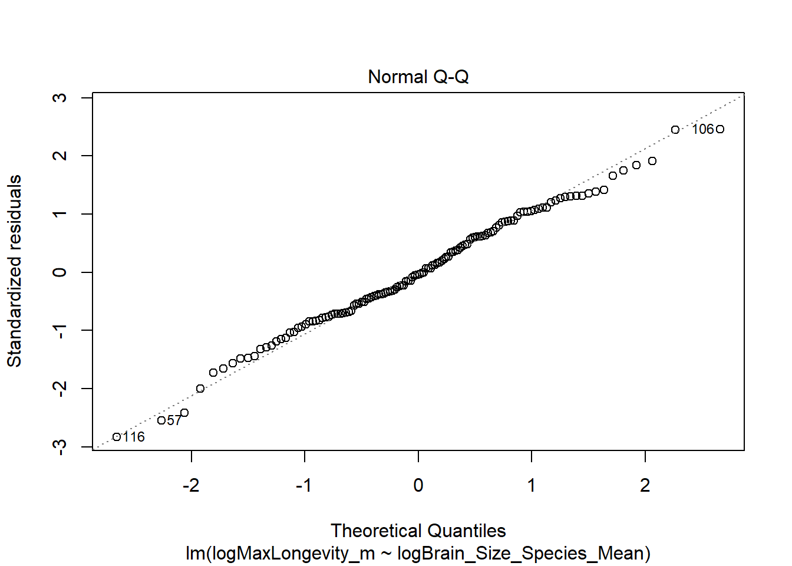

## R Markdown
```
## Including Plots
You can also embed plots, for example:

Note that the `echo = FALSE` parameter was added to the code chunk to prevent printing of the R code that generated the plot.
----------------------------------------------------
###[1] Write a simple R function, Z.prop.test(), that can perform one- or two-sample Z-tests for proportion data, using the following guidelines:
Your function should take the following arguments: p1 and n1 (no default) representing the estimated proportion and sample size (i.e., based on your sample data); p2 and n2 (both defaulting to NULL) that contain a second sample’s proportion and sample size data in the event of a two-sample test; p0 (no default) as the expected value for the population proportion; and alternative (default “two.sided”) and conf.level (default 0.95), to be used in the same way as in the function t.test().
When conducting a two-sample test, it should be p1 that is tested as being smaller or larger than p2 when alternative=“less” or alternative=“greater”, the same as in the use of x and y in the function t.test().
The function should perform a one-sample Z-test using p1, n1, and p0 if either p2 or n2 (or both) is NULL.
The function should contain a check for the rules of thumb we have talked about (n∗p>5 and n∗(1−p)>5) to ensure the validity of assuming the normal distribution in both the one- and two-sample settings. If this is violated, the function should still complete but it should also print an appropriate warning message.
The function should return a list containing the members Z (the test statistic), P (the appropriate p value), and CI (the two-sided CI with respect to “conf.level” around p1 in the case of a one-sample test and around p2-p1 in the case of a two-sample test). For all test alternatives (“two.sided”, “greater”, “less”), calculate symmetric CIs based on quantiles of the normal distribution rather than worrying about calculating single-limit confidence bounds.

```

```r
z.prop.test <-function(p1,n1,p0,p2=NULL,n2=NULL,conf.level=0.95,alternative="two.sided") {if(p1 == 0){return(0)}else {if((n1 * p1 < 5) | (n1 * (1-p1) > 5)){return(c("Warning: Not Normal", (p1-p0) / sqrt((p0 * (1-p0))/n1)))} else(return((p1-p0) / sqrt((p0 * (1-p0))/n1)))}}
###I don't fully understand why and how you know to do different lines.  It seems like this doesn't matter. Spacing doesn't matter. 
###Only works with two ==
###Just plugging in what the instructions said.  Unsure if all right, especially second half.  This should be for one sample, following these rules of thumb. 
###two sample test
z.test.2 <- function(p1,n1,p0,p2,n2,conf.level=0.95,alternative="two.sided") {if(p1 == 0){return(0)}
else {if((n1 * p1 < 5) | (n1 * (1-p1) < 5)){return(c("Warning: This aint normal", (p1-p0) / sqrt((p0 * (1-p0))/n1)))}
else(return((p1-p0) / sqrt((p0 * (1-p0))/n1)))}
  ###I realized I could have it give me funny warnings, so I added this.  Kind of makes coding more fun, no?
  ###for second sample
if(p2 == 0){return(0)}else {if((n2 * p2 < 5) | (n2 * (1-p2) < 5)){return(c("Warning: A real not normal situation you got yourself here, buddy", (p2-p0) / sqrt((p0 * (1-p0))/n2)))}else(return((p2-p0) / sqrt((p0 * (1-p0))/n2)))}}
###Note the similarity between the two
###Do I need to test each function?
###I really struggling with reading all of the instructions and knowing what order I should do things in... I am also not sure what I missed if anything and why...
###I am not getting any errors when I run the chunk. 
###This function isn't working:   return(list(z,p,ci))  Maybe I am running it too early?
###This is a good way to add the label: 
     ###  cat( "Z_score =", Z.two.sample <- Z.two.sample, "\n", 
     ###"CI =", CI.two.sample <- CI.two.sample, "\n", 
     ###"P-Value =", P.Value <- P.Value, "\n") }
###IF YOU TYPE IN THE NAME OF A FUNCTION, WITH NO PARENTHESIS, AND PRESS ENTER, YOU CAN SEE WHAT IS "UNDER THE HOOD". 


###This is the information that I find for it online: prop.test(x, n, p = NULL, alternative = “two.sided”, correct = TRUE)
#########x: a vector of counts of successes
#########n: a vector of count trials
#########alternative: a character string specifying the alternative hypothesis
#########correct: a logical indicating whether Yates’ continuity correction should be applied where possible
#########Note that, by default, the function prop.test() used the Yates continuity correction, which is really important if either the expected successes or failures is < 5. If you don’t want the correction, use the additional argument correct = FALSE in prop.test() function. The default value is TRUE. (This option must be set to FALSE to make the test mathematically equivalent to the uncorrected z-test of a proportion.)
```


```r
###one sample: sample proportion is 10%, size is 100, expected population proportion is 25%. Is this anything???
###two sample: proportion is 50% size is 500 expected is 30%

z.prop.test(p1=.10,n1=100,p0=.25,p2=NULL,n2=NULL,conf.level=0.95,alternative="two.sided")
```

```
## [1] "Warning: Not Normal" "-3.46410161513775"
```

```r
z.prop.test(p1=.50,n1=500,p0=.30,p2=NULL,n2=NULL,conf.level=0.95,alternative="two.sided")
```

```
## [1] "Warning: Not Normal" "9.75900072948533"
```

```r
###two sample test: 
z.test.2(p1=.10,n1=100,p0=.25,p2=.15,n2=50,conf.level=0.95,alternative="two.sided")
```

```
## [1] -3.464102
```

```r
z.test.2(p1=.50,n1=500,p0=.30,p2=.15,n2=50,conf.level=0.95,alternative="two.sided")
```

```
## [1] 9.759001
```

```r
###What are P2 and n2??????
```
###The function should return a list containing the members Z (the test statistic), P (the appropriate p value), and CI (the two-sided CI with respect to “conf.level” around p1 in the case of a one-sample test and around p2-p1 in the case of a two-sample test). For all test alternatives (“two.sided”, “greater”, “less”), calculate symmetric CIs based on quantiles of the normal distribution rather than worrying about calculating single-limit confidence bounds.

```r
   z.prop.test(p1 = 0.6, n1 = 30, p0 = 0.5, conf.level = 0.95) 
```

```
## [1] "Warning: Not Normal" "1.09544511501033"
```

```r
    z.prop.test(p1 = 0.6, n1 = 5, p0 = 0.5, alternative = "less", conf.level = 0.95)
```

```
## [1] "Warning: Not Normal" "0.447213595499958"
```

```r
    z.prop.test(p1 = 0.6, n1 = 30, p0 = 0, p2 = 0.8, n2 = 25, conf.level = 0.95)
```

```
## [1] "Warning: Not Normal" "Inf"
```

```r
    z.prop.test(p1 = 0.6, n1 = 30, p0 = 0.4, n2 = 25, conf.level = 0.95)
```

```
## [1] "Warning: Not Normal" "2.23606797749979"
```

```r
    z.prop.test(p1 = 0.6, n1 = 50, p0 = 0, p2 = 0.8, n2 = 60, alternative = "greater", conf.level = 0.95)
```

```
## [1] "Warning: Not Normal" "Inf"
```

```r
    ###Was hoping my silly not normal error would show up.  Oh well!  
    ###MANY MANY MANY THANKS to Diego for helping me with this part. 
    ### What does "Inf" mean in the answer??????? I get this for the 3rd and 5th rows. 
```
###[2] The dataset from Kamilar and Cooper has in it a large number of variables related to life history and body size. For this exercise, the end aim is to fit a simple linear regression model to predict longevity (MaxLongevity_m) measured in months from species’ brain size (Brain_Size_Species_Mean) measured in grams. Do the following for both longevity~brain size and log(longevity)~log(brain size):
Fit the regression model and, using {ggplot2}, produce a scatterplot with the fitted line superimposed upon the data. Append the the fitted model equation to your plot (HINT: use the function geom_text()).
Identify and interpret the point estimate of the slope (β1), as well as the outcome of the test associated with the hypotheses H0: β1 = 0; HA: β1 ≠ 0. Also, find a 90 percent CI for the slope (β1) parameter.
Using your model, add lines for the 90 percent confidence and prediction interval bands on the plot and add a legend to differentiate between the lines.
Produce a point estimate and associated 90 percent PI for the longevity of a species whose brain weight is 800 gm. Do you trust the model to predict observations accurately for this value of the explanatory variable? Why or why not?
Looking at your two models, which do you think is better? Why?

###Download the data

```r
library(curl)
```

```
## Warning: package 'curl' was built under R version 4.1.1
```

```
## Using libcurl 7.64.1 with Schannel
```

```r
f <- curl("https://raw.githubusercontent.com/fuzzyatelin/fuzzyatelin.github.io/master/AN588_Fall21/KamilarAndCooperData.csv")
d <- read.csv(f, header = TRUE, sep = ",", stringsAsFactors = FALSE)
head(d)
```

```
##               Scientific_Name          Family          Genus      Species
## 1 Allenopithecus_nigroviridis Cercopithecidae Allenopithecus nigroviridis
## 2         Allocebus_trichotis Cercopithecidae      Allocebus    trichotis
## 3           Alouatta_belzebul        Atelidae       Alouatta     belzebul
## 4             Alouatta_caraya        Atelidae       Alouatta       caraya
## 5            Alouatta_guariba        Atelidae       Alouatta      guariba
## 6           Alouatta_palliata        Atelidae       Alouatta     palliata
##   Brain_Size_Species_Mean Brain_Size_Female_Mean   Brain_size_Ref
## 1                   58.02                  53.70 Isler et al 2008
## 2                      NA                     NA                 
## 3                   52.84                  51.19 Isler et al 2008
## 4                   52.63                  47.80 Isler et al 2008
## 5                   51.70                  49.08 Isler et al 2008
## 6                   49.88                  48.04 Isler et al 2008
##   Body_mass_male_mean Body_mass_female_mean Mass_Dimorphism
## 1                6130                  3180           1.928
## 2                  92                    84           1.095
## 3                7270                  5520           1.317
## 4                6525                  4240           1.539
## 5                5800                  4550           1.275
## 6                7150                  5350           1.336
##                 Mass_Ref MeanGroupSize AdultMales AdultFemale AdultSexRatio
## 1       Isler et al 2008            NA         NA          NA            NA
## 2 Smith and Jungers 1997          1.00       1.00         1.0            NA
## 3       Isler et al 2008          7.00       1.00         1.0          1.00
## 4       Isler et al 2008          8.00       2.30         3.3          1.43
## 5       Isler et al 2008          6.53       1.37         2.2          1.61
## 6       Isler et al 2008         12.00       2.90         6.3          2.17
##                                                     Social_Organization_Ref
## 1                                                                          
## 2                                                             Kappeler 1997
## 3                                                       Campbell et al 2007
## 4 van Schaik et al. 1999; Kappeler and Pereira 2003; Nunn & van Schaik 2000
## 5                                                       Campbell et al 2007
## 6 van Schaik et al. 1999; Kappeler and Pereira 2003; Nunn & van Schaik 2000
##   InterbirthInterval_d Gestation WeaningAge_d MaxLongevity_m LitterSz
## 1                   NA        NA       106.15          276.0     1.01
## 2                   NA        NA           NA             NA     1.00
## 3                   NA        NA           NA             NA       NA
## 4               337.62       187       323.16          243.6     1.01
## 5                   NA        NA           NA             NA       NA
## 6               684.37       186       495.60          300.0     1.02
##    Life_History_Ref GR_MidRangeLat_dd Precip_Mean_mm Temp_Mean_degC AET_Mean_mm
## 1 Jones et al. 2009             -0.17         1574.0           25.2      1517.8
## 2                              -16.59         1902.3           20.3      1388.2
## 3                               -6.80         1643.5           24.9      1286.6
## 4 Jones et al. 2009            -20.34         1166.4           22.9      1193.1
## 5                              -21.13         1332.3           19.6      1225.7
## 6 Jones et al. 2009              6.95         1852.6           23.7      1300.0
##   PET_Mean_mm       Climate_Ref HomeRange_km2      HomeRangeRef DayLength_km
## 1      1589.4 Jones et al. 2009            NA                             NA
## 2      1653.7 Jones et al. 2009            NA                             NA
## 3      1549.8 Jones et al. 2009            NA                             NA
## 4      1404.9 Jones et al. 2009            NA                           0.40
## 5      1332.2 Jones et al. 2009          0.03 Jones et al. 2009           NA
## 6      1633.9 Jones et al. 2009          0.19 Jones et al. 2009         0.32
##       DayLengthRef Territoriality Fruit Leaves Fauna             DietRef1
## 1                              NA    NA                                  
## 2                              NA    NA                                  
## 3                              NA  57.3   19.1   0.0 Campbell et al. 2007
## 4 Nunn et al. 2003             NA  23.8   67.7   0.0 Campbell et al. 2007
## 5                              NA   5.2   73.0   0.0 Campbell et al. 2007
## 6 Nunn et al. 2003         0.6506  33.1   56.4   0.0 Campbell et al. 2007
##   Canine_Dimorphism Canine_Dimorphism_Ref  Feed  Move  Rest Social
## 1             2.210   Plavcan & Ruff 2008    NA    NA    NA     NA
## 2                NA                          NA    NA    NA     NA
## 3             1.811   Plavcan & Ruff 2008 13.75 18.75 57.30  10.00
## 4             1.542   Plavcan & Ruff 2008 15.90 17.60 61.60   4.90
## 5             1.783   Plavcan & Ruff 2008 18.33 14.33 64.37   3.00
## 6             1.703   Plavcan & Ruff 2008 17.94 12.32 66.14   3.64
##    Activity_Budget_Ref
## 1                     
## 2                     
## 3 Campbell et al. 2007
## 4 Campbell et al. 2007
## 5 Campbell et al. 2007
## 6 Campbell et al. 2007
```

```r
names(d)
```

```
##  [1] "Scientific_Name"         "Family"                 
##  [3] "Genus"                   "Species"                
##  [5] "Brain_Size_Species_Mean" "Brain_Size_Female_Mean" 
##  [7] "Brain_size_Ref"          "Body_mass_male_mean"    
##  [9] "Body_mass_female_mean"   "Mass_Dimorphism"        
## [11] "Mass_Ref"                "MeanGroupSize"          
## [13] "AdultMales"              "AdultFemale"            
## [15] "AdultSexRatio"           "Social_Organization_Ref"
## [17] "InterbirthInterval_d"    "Gestation"              
## [19] "WeaningAge_d"            "MaxLongevity_m"         
## [21] "LitterSz"                "Life_History_Ref"       
## [23] "GR_MidRangeLat_dd"       "Precip_Mean_mm"         
## [25] "Temp_Mean_degC"          "AET_Mean_mm"            
## [27] "PET_Mean_mm"             "Climate_Ref"            
## [29] "HomeRange_km2"           "HomeRangeRef"           
## [31] "DayLength_km"            "DayLengthRef"           
## [33] "Territoriality"          "Fruit"                  
## [35] "Leaves"                  "Fauna"                  
## [37] "DietRef1"                "Canine_Dimorphism"      
## [39] "Canine_Dimorphism_Ref"   "Feed"                   
## [41] "Move"                    "Rest"                   
## [43] "Social"                  "Activity_Budget_Ref"
```

```r
###Is this right as a means of loading?  I think I feel pretty confident about this one. 
```
###For this exercise, the end aim is to fit a simple linear regression model to predict longevity (MaxLongevity_m) measured in months from species’ brain size (Brain_Size_Species_Mean) measured in grams. Do the following for both longevity~brain size and log(longevity)~log(brain size):


```r
plot(data = d, MaxLongevity_m ~ Brain_Size_Species_Mean)
```


```r
###What even is this graph.  A whole hodgepodge is what it is. 
```

```r
model <- lm(data = d, MaxLongevity_m ~ Brain_Size_Species_Mean)
summary(model)
```

```
## 
## Call:
## lm(formula = MaxLongevity_m ~ Brain_Size_Species_Mean, data = d)
## 
## Residuals:
##     Min      1Q  Median      3Q     Max 
## -198.27  -61.92  -17.78   56.16  331.36 
## 
## Coefficients:
##                         Estimate Std. Error t value Pr(>|t|)    
## (Intercept)             248.9523    11.1111   22.41   <2e-16 ***
## Brain_Size_Species_Mean   1.2180     0.1101   11.06   <2e-16 ***
## ---
## Signif. codes:  0 '***' 0.001 '**' 0.01 '*' 0.05 '.' 0.1 ' ' 1
## 
## Residual standard error: 90.91 on 126 degrees of freedom
##   (85 observations deleted due to missingness)
## Multiple R-squared:  0.4928,	Adjusted R-squared:  0.4887 
## F-statistic: 122.4 on 1 and 126 DF,  p-value: < 2.2e-16
```

```r
plot(model)
```


```r
d$logMaxLongevity_m <- log(d$MaxLongevity_m)
d$logBrain_Size_Species_Mean <- log(d$Brain_Size_Species_Mean)
plot(data = d, logMaxLongevity_m ~ logBrain_Size_Species_Mean)
```


```r
model <- lm(data = d, logMaxLongevity_m ~ logBrain_Size_Species_Mean)
summary(model)
```

```
## 
## Call:
## lm(formula = logMaxLongevity_m ~ logBrain_Size_Species_Mean, 
##     data = d)
## 
## Residuals:
##     Min      1Q  Median      3Q     Max 
## -0.6955 -0.1750 -0.0097  0.1788  0.6084 
## 
## Coefficients:
##                            Estimate Std. Error t value Pr(>|t|)    
## (Intercept)                 4.87895    0.06907   70.63   <2e-16 ***
## logBrain_Size_Species_Mean  0.23415    0.01781   13.15   <2e-16 ***
## ---
## Signif. codes:  0 '***' 0.001 '**' 0.01 '*' 0.05 '.' 0.1 ' ' 1
## 
## Residual standard error: 0.2485 on 126 degrees of freedom
##   (85 observations deleted due to missingness)
## Multiple R-squared:  0.5784,	Adjusted R-squared:  0.5751 
## F-statistic: 172.9 on 1 and 126 DF,  p-value: < 2.2e-16
```

```r
plot(model)
```



```r
###I can just click through to see all the graphs. 
```
###Identify and interpret the point estimate of the slope (β1), as well as the outcome of the test associated with the hypotheses H0: β1 = 0; HA: β1 ≠ 0. 
###Run a line in order to find the slope.


```r
library(ggplot2)
```

```
## Warning: package 'ggplot2' was built under R version 4.1.1
```

```r
g <- ggplot(data = d, aes(x = d$logBrain_Size_Species_Mean, y = d$logMaxLongevity_m)) + geom_point()
g
```

```
## Warning: Use of `d$logBrain_Size_Species_Mean` is discouraged. Use
## `logBrain_Size_Species_Mean` instead.
```

```
## Warning: Use of `d$logMaxLongevity_m` is discouraged. Use `logMaxLongevity_m`
## instead.
```

```
## Warning: Removed 85 rows containing missing values (geom_point).
```


```r
###Kind of positive correlation. 
```


```r
b <- d$logBrain_Size_Species_Mean
l <- d$logMaxLongevity_m
m <- lm(l ~ b)
m
```

```
## 
## Call:
## lm(formula = l ~ b)
## 
## Coefficients:
## (Intercept)            b  
##      4.8790       0.2341
```

```r
###Coefficients:Intercept = 4.8790 and b = 0.2341
```


```r
library(lmodel2)  
```

```
## Warning: package 'lmodel2' was built under R version 4.1.1
```

```r
###load the lmodel2 package
mII <- lmodel2(MaxLongevity_m ~ Brain_Size_Species_Mean, data = d, range.y = "relative", range.x = "relative", 
    nperm = 1000)
mII
```

```
## 
## Model II regression
## 
## Call: lmodel2(formula = MaxLongevity_m ~ Brain_Size_Species_Mean, data
## = d, range.y = "relative", range.x = "relative", nperm = 1000)
## 
## n = 128   r = 0.7019753   r-square = 0.4927693 
## Parametric P-values:   2-tailed = 2.685909e-20    1-tailed = 1.342954e-20 
## Angle between the two OLS regression lines = 17.35978 degrees
## 
## Permutation tests of OLS, MA, RMA slopes: 1-tailed, tail corresponding to sign
## A permutation test of r is equivalent to a permutation test of the OLS slope
## P-perm for SMA = NA because the SMA slope cannot be tested
## 
## Regression results
##   Method Intercept    Slope Angle (degrees) P-perm (1-tailed)
## 1    OLS  248.9523 1.217990        50.61316       0.000999001
## 2     MA  185.9393 2.121962        64.76728       0.000999001
## 3    SMA  212.9069 1.735090        60.04348                NA
## 4    RMA  204.1621 1.860542        61.74296       0.000999001
## 
## Confidence intervals
##   Method 2.5%-Intercept 97.5%-Intercept 2.5%-Slope 97.5%-Slope
## 1    OLS       226.9637        270.9408   1.000130    1.435851
## 2     MA       154.8589        209.0668   1.790180    2.567837
## 3    SMA       196.7709        227.1436   1.530853    1.966575
## 4    RMA       177.9787        225.1284   1.559764    2.236164
## 
## Eigenvalues: 19247.81 2287.528 
## 
## H statistic used for computing C.I. of MA: 0.004757621
```


```r
plot(mII, "OLS") 
```


```r
###OLS stands for ordinary least squares
###plotting results of lmodel2
plot(mII, "RMA")
```


```r
###RMA stands for Robust multi-aray average
plot(mII, "SMA")
```


```r
###SMA is simple moving average 
###Shows a positive trend, but looks like a hodge podge to me still. 
```


```r
m <- lm(data = d, logMaxLongevity_m ~ logBrain_Size_Species_Mean)
h_hat <- predict(m, newdata = data.frame(logBrain_Size_Species_Mean = d$logBrain_Size_Species_Mean))
df <- data.frame(cbind(d$logBrain_Size_Species_Mean, d$logMaxLongevity_m, h_hat))
names(df) <- c("x", "y", "yhat")
head(df)
```

```
##          x        y     yhat
## 1 4.060788 5.620401 5.829783
## 2       NA       NA       NA
## 3 3.967268       NA 5.807885
## 4 3.963286 5.495528 5.806953
## 5 3.945458       NA 5.802778
## 6 3.909620 5.703782 5.794387
```


```r
ci <- predict(m, newdata = data.frame(logBrain_Size_Species_Mean = d$logBrain_Size_Species_Mean), interval = "confidence", 
    level = 0.90)  # for a vector of values
head(ci)
```

```
##        fit      lwr      upr
## 1 5.829783 5.791675 5.867891
## 2       NA       NA       NA
## 3 5.807885 5.770504 5.845267
## 4 5.806953 5.769598 5.844308
## 5 5.802778 5.765539 5.840018
## 6 5.794387 5.757357 5.831416
```


```r
df <- cbind(df, ci)
names(df) <- c("x", "y", "yhat", "CIfit", "CIlower", "CIupper")
###Naming the columns
head(df)
```

```
##          x        y     yhat    CIfit  CIlower  CIupper
## 1 4.060788 5.620401 5.829783 5.829783 5.791675 5.867891
## 2       NA       NA       NA       NA       NA       NA
## 3 3.967268       NA 5.807885 5.807885 5.770504 5.845267
## 4 3.963286 5.495528 5.806953 5.806953 5.769598 5.844308
## 5 3.945458       NA 5.802778 5.802778 5.765539 5.840018
## 6 3.909620 5.703782 5.794387 5.794387 5.757357 5.831416
```


```r
###Upper and Lower Confidence Intervals 
###SHOOT. I can't remember how to call ggplot....curl?install?library?
###Does anyone else feel like a G-D when they finally figure out the most basic thing in R?!?!?!
library(ggplot2)
g <- ggplot(data = df, aes(x = x, y = y))
g <- g + geom_point(alpha = 1/2)
g <- g + geom_line(aes(x = x, y = CIfit), colour = "red")
g <- g + geom_line(aes(x = x, y = CIlower), colour = "blue")
g <- g + geom_line(aes(x = x, y = CIupper), colour = "green")
g
```

```
## Warning: Removed 85 rows containing missing values (geom_point).
```

```
## Warning: Removed 42 row(s) containing missing values (geom_path).

## Warning: Removed 42 row(s) containing missing values (geom_path).

## Warning: Removed 42 row(s) containing missing values (geom_path).
```


```r
###Okay, I can kind of see the trend.  I get what I did so that's neat. 
```
#####WarrenKevins Code:
model1 <- lm(KC$MaxLongevity_m ~ KC$Brain_Size_Species_Mean)
summary(model1)
x <- KC$Brain_Size_Species_Mean
y <- KC$MaxLongevity_
conf_interval <- predict(model1, newdata = data.frame(Brain_Size_Species_Mean = x),, interval = "confidence", level = 0.90)
colnames(conf_interval) <-c("Fit_C","Lower_C","Upper_C")
head(conf_interval)
summary(KC$MaxLongevity_m)
pred_interval <- predict(model1, newdata = data.frame(Brain_Size_Species_Mean = x),, interval = "prediction", level = 0.90)
colnames(pred_interval) <-c("Fit_P","Lower_P","Upper_P")
ggplot(mydata, aes(x = x, y = y)) + theme_minimal() +
          geom_point() + labs(x = "log(Mean Species Brain Size)", y = "log(Max Longevity)", size = 14) +
          geom_line(aes(x = x, y = Fit_C, color = "Confidence")) +
          geom_line(aes(x = x, y = Lower_C, color = "Confidence")) +
          geom_line(aes(x = x, y = Upper_C, color = "Confidence")) + geom_smooth(method=lm)


```r
###PI and Data frame
pi <- predict(m, newdata = data.frame(logBrain_Size_Species_Mean = d$logBrain_Size_Species_Mean), interval = "prediction", level = 0.90)  
###introduce log(800) as logBrain_Size_Species_Mean????
###for a vector of values
head(pi)
```

```
##        fit      lwr      upr
## 1 5.829783 5.416322 6.243243
## 2       NA       NA       NA
## 3 5.807885 5.394491 6.221279
## 4 5.806953 5.393561 6.220344
## 5 5.802778 5.389397 6.216159
## 6 5.794387 5.381024 6.207749
```

```r
df <- cbind(df, pi) 
###dataframe
names(df) <- c("x", "y", "yhat", "CIfit", "CIlower", "CIupper", "PIfit", "PIlower","PIupper")
###Those bad boys need a name. 
###I wish there was a way to make the uppercase I look like less of an lowercase l in the table. 
head(df)
```

```
##          x        y     yhat    CIfit  CIlower  CIupper    PIfit  PIlower
## 1 4.060788 5.620401 5.829783 5.829783 5.791675 5.867891 5.829783 5.416322
## 2       NA       NA       NA       NA       NA       NA       NA       NA
## 3 3.967268       NA 5.807885 5.807885 5.770504 5.845267 5.807885 5.394491
## 4 3.963286 5.495528 5.806953 5.806953 5.769598 5.844308 5.806953 5.393561
## 5 3.945458       NA 5.802778 5.802778 5.765539 5.840018 5.802778 5.389397
## 6 3.909620 5.703782 5.794387 5.794387 5.757357 5.831416 5.794387 5.381024
##    PIupper
## 1 6.243243
## 2       NA
## 3 6.221279
## 4 6.220344
## 5 6.216159
## 6 6.207749
```


```r
###All together
g <- g + geom_line(data = df, aes(x = x, y = PIlower), colour = "red")
g1 <- g + geom_line(data = df, aes(x = x, y = PIupper), colour = "darkgreen")
g
```

```
## Warning: Removed 85 rows containing missing values (geom_point).
```

```
## Warning: Removed 42 row(s) containing missing values (geom_path).

## Warning: Removed 42 row(s) containing missing values (geom_path).

## Warning: Removed 42 row(s) containing missing values (geom_path).

## Warning: Removed 42 row(s) containing missing values (geom_path).
```


```r
###I changed the name and now its kinda screwed up and I am not sure why...It also doesn't give me an error until I call the specific function, which feels problematic I won't lie...I fixed it because I am a genius.  Moral of the story, don't change names halfway thorough. 
```
###Produce a point estimate and associated 90 percent PI for the longevity of a species whose brain weight is 800 gm. 


```r
pi <- predict(m, newdata = data.frame(logBrain_Size_Species_Mean = 800), interval = "prediction", 
    level = 0.9)
pi
```

```
##        fit      lwr      upr
## 1 192.1986 168.6955 215.7017
```
###estimate: 192.1986 for lower and upper: 168.6955, 215.7017

###Do you trust the model to predict observations accurately for this value of the explanatory variable? Why or why not?  No?  Because lots outside CI???--> We can't trust this very much because our value are not in the range we predicted. 

Looking at your two models, which do you think is better? Why?  Thanks to help from Diego, I think the logarithm model is better than the other model.  This is because the R squared is higher and the PIs are tighter. 

1. The length of these modules is my biggest challenge.  I am the worlds slowest coder oh my goodness. 
2. I found some helpful things online, but now I don't think I did a great job annotating, because I am not positive what all I was doing. 
3. I am not sure about the sample numbers I chose in number 1. 
4. In general, I just need to go back over the modules again. 
5. Is Z.prop.test the same as Z.test?
6. I can't get the running thing to show up????

###Someone had told me on an earlier assignment that I could put descritions in the {r} on the top of my code, but when I do that it doesnt run anymore...
###I feel like I am relying really heavily on other peoples codes and help material that I find online. 
